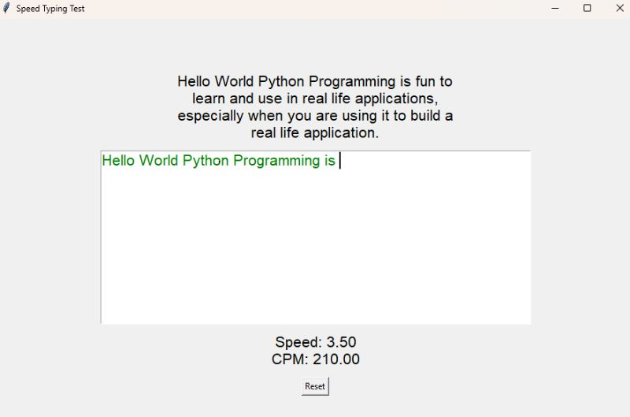

# Speed Typing Test 
This project is a Speed Typing Test in Python that allows users to improve their typing speed and accuracy by practicing typing random words within a specified time. The application has a Graphical User Interface (GUI) that displays the timer, the word to type, and an input field for the user to enter their text.

  
   

## Features:

Timer: The application uses a countdown timer from a predefined time (e.g., 60 seconds). The timer starts when the game begins and stops when either the time runs out or the user finishes typing all the words.

Random Word Generation: For each attempt, a word is randomly selected from a predefined list. This provides variety and prevents the same words from appearing every time, allowing for more comprehensive practice.

Score Calculation: The player's score is calculated based on the time taken to type each word and the word's length. This motivates the player to type quickly and accurately.

Graphical User Interface (GUI): The GUI provides a user-friendly experience, showing the timer, the current word, an input field for the user to type, and a results message upon finishing the game.

Interface Updates: The timer is regularly updated on the interface to show real-time remaining time. This keeps the player informed about the available time.

Visual Feedback: The interface provides visual feedback to the user, such as highlighting correctly typed words in green and incorrectly typed words in red.

Configurable Options: The code is designed to be easily configurable. For example, the timer duration and the word list can be easily modified to accommodate different difficulty levels or user interests.

## Project Requirements:

Python 3.x
Graphics library for the graphical user interface (Tkinter)

## Instructions for Use:

Make sure you have Python 3.x installed on your system.

Install the required graphics library if you haven't already (e.g., pip install tk for Tkinter).

Run the speed_typing_test.py script.

The GUI will display a countdown timer, a word to type, and an input field.

Type the word into the input field and press "Enter" to submit your answer.

Continue typing the words until the time runs out or you have completed all the words.

Upon finishing, your score will be displayed, and you can choose to play again.